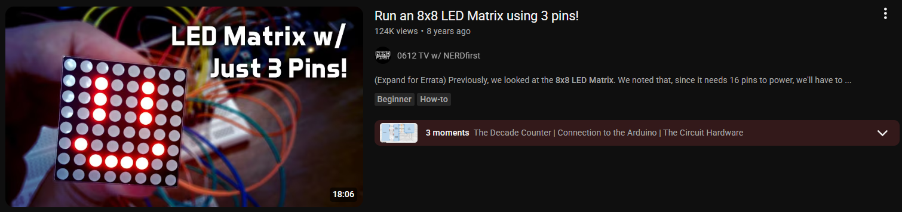
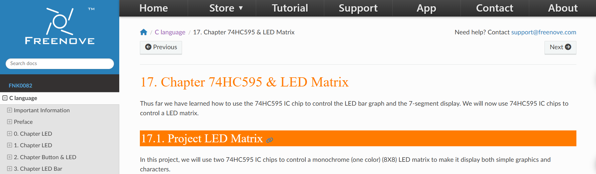
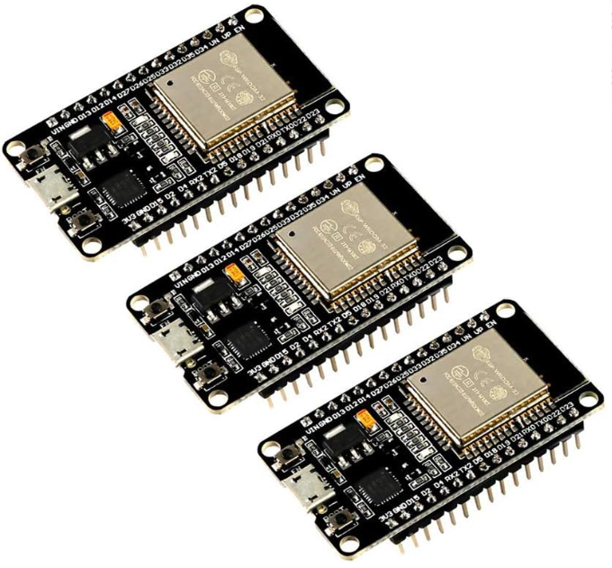
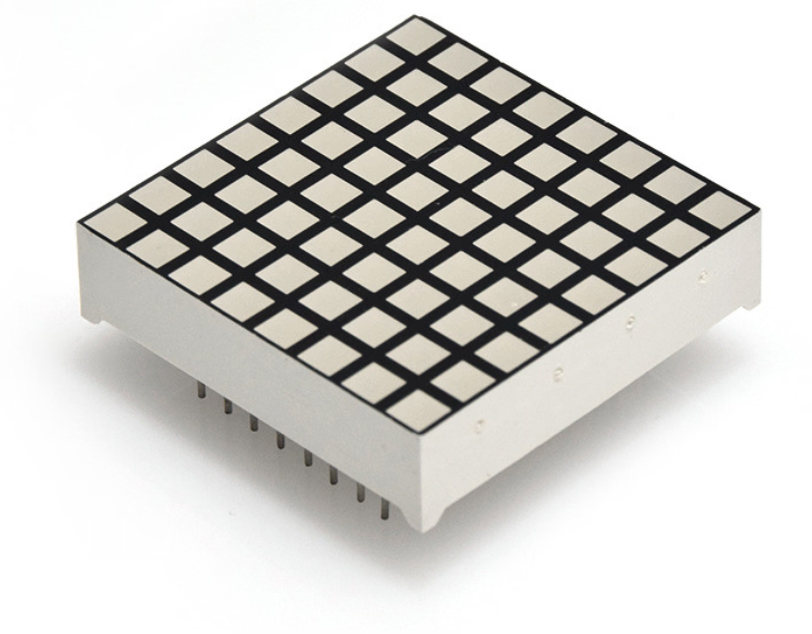
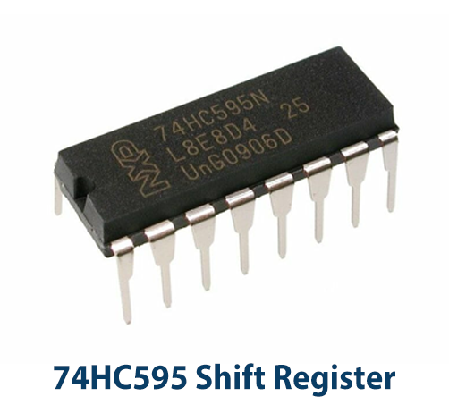
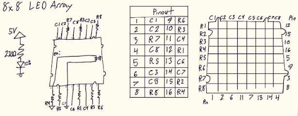
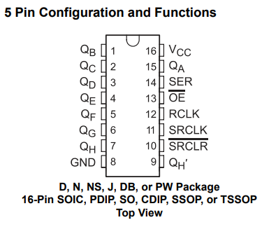
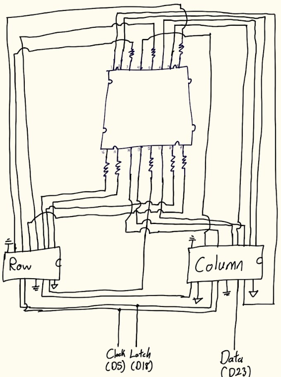
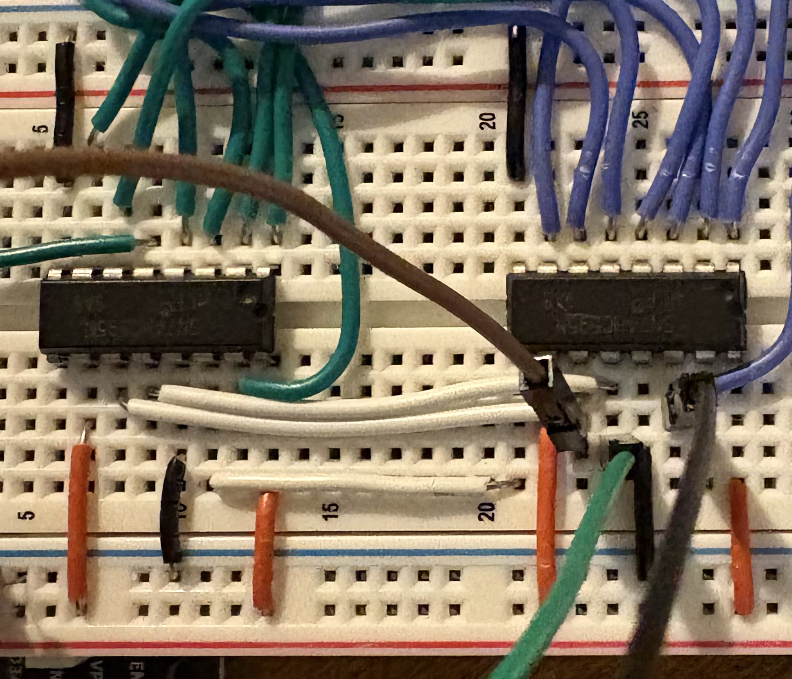

# README

## Description

This is my project for my ESP32-controlled 8x8 LED array.

It currently can only work on one array, but it should not be difficult to scale the program to a variable number of rows and columns of arrays...arrays of arrays if you will ;)

**Demo**

***
The program `led_array.ino` is largely inspired by a video by **0612 TV w/ NERDfirst**:

https://www.youtube.com/watch?v=NM7wXta8crM

In addition to the following article:

https://docs.freenove.com/projects/fnk0082/en/latest/fnk0082/codes/C/16_74HC595_%26_LED_Matrix.html

***

I used the concepts introduced in the sources to make animations for the LED array and to display simulated signals by the LED array.

|**Snake**|**Explosion**|
|-------|-----------|
|||

|**Symmetric (Mirrored) Filled Sin**|**Symmetric Dotted Sin**|
|-------|-----------|
|||

|**Filled Sin**|
|-------|
||

|**Filled Random Signal**|**Dotted Sin**|
|-------|-----------|
|||

## Parts List

| **ESP32 Devkit V1 DOIT** | **8x8 LED Array** | **74HC595 Shift Register** |
| ------------------------ | --------------------------- | --------------------- |
|           |        |     |

## Pinouts

| ESP32 Devkit|
|------|
||

|8x8 LED Array|
|------|
|I had the *wonderful* opportunity to forget where I ordered my LED Arrays from, so I am unclear on how to get an official datasheet. Through trial and error, I was able to find what pins correlate to what rows/columns and the diodes' polarities.
|

|74HC595|
|-------|
|[74HC595 datasheet](https://www.ti.com/lit/ds/symlink/sn74hc595.pdf)
|

## Wiring Diagram

It's crudely drawn but it's not easy making such a tangled mess look organized. I'll update with a better diagram if I make one.

**ESP32 Wiring**

**74HC595 Wiring**

**LED Array Wiring**

****

## Code Description

The heart of the code is the `displayVerticalImage()` and `displayHorizontalImage()` function. They work like different orientations of rolling shutters, only displaying one column at a time. With a very high frequency, this effect is invisible to the eye.

Images to be displayed are converted into bit representations as integers and are shifted through the shift registers to complete circuits for each LED pixel.

I then created some `[]_signal()` functions for various displays of simulated signals.

## Conclusion & Further Work

I intend to use the program's capability to display a simulated signal to read an audio signal. I plan on using an opamp along with a voltage divider to convert the audio signal to a range the microcontroller can safely read.

After an audio signal can be displayed, I plan on implementing an FFT algorithm to display a signal's real-time frequency data.

It would be fun to then add a speaker output and maybe BlueTooth connection. Then I would put it all in a vintage radio style enclosure to listen to music/podcasts/etc. and watch the audio signal or real-time data.
